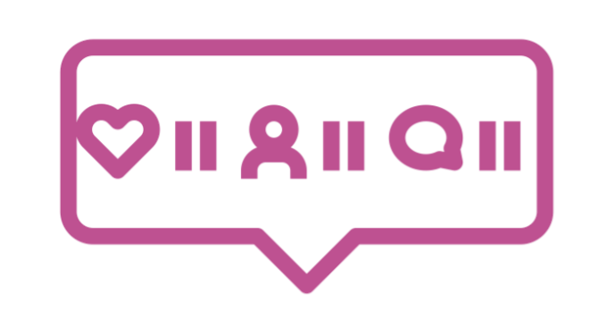

  

# MySocials

MySocials is a social network application using MERN stack technologies. 

## Features
- user authentication: ability to sign in or sign up and create a profile
- ability to post 
- ability to comment
- ability to like
- ability to unlike
- ability to delete your post or comment
- ability to log out

## Technologies used
- React
- Hooks
- Semantic-UI
- Node.js
- MongoDB Atlas
- GraphQl
- Apollo
- mongoose

### Front end 
App deployed on Netlify: [MySocials](https://mysocialsapp.netlify.app/)

### Back end 
Server deployed on Heroku: [Server](https://stark-peak-97627.herokuapp.com/)

Server repository on Github: [Code](https://github.com/luluse/mySocials-server)

## User Stories
- As a user I want to be able to sign up and create a profile.
- As a user I want to be able to log in to my profile.
- As a user I want to be able to create a post.
- As a user I want to be able to comment on posts.
- As a user I want to be able to delete my posts or my comments.
- As a user I want to be able to like and unlike other users posts.

## Acknowledgments
- I build this application following Classsed tutorial: [React/GraphQL Course - Build a social media app (MERNG Stack)](https://www.youtube.com/watch?v=n1mdAPFq2Os)